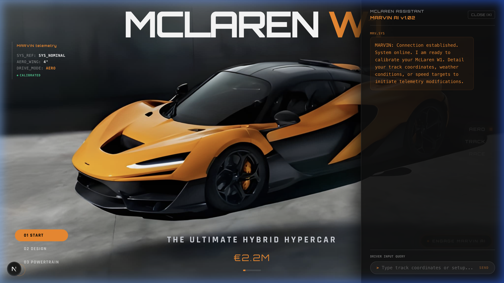
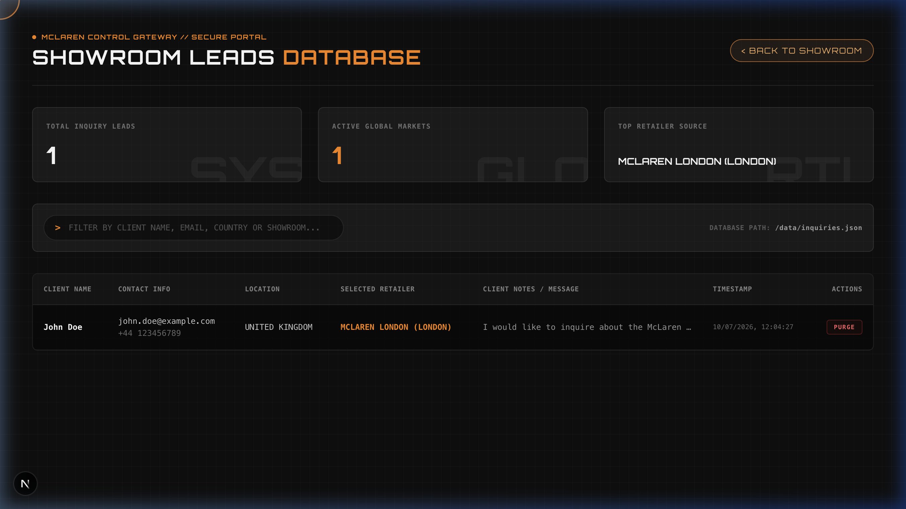

# 🏎️ McLaren W1 | The Ultimate Hybrid Hypercar Landing Experience

An interactive, full-stack, and AI-driven landing page experience dedicated to the **McLaren W1**—the ultimate successor to the legendary F1 and P1 hypercars. Engineered with a Next.js backend, a localized RAG-based AI copilot, and a persistent lead management admin dashboard, this project is built to demonstrate high-performance web development patterns suitable for production.

---

## 🚀 Key Highlights

*   **🎬 Cinematic Interactive Scroll-Canvas**: Custom scroll-scrubbing framework syncing an 81-frame high-resolution 3D rotation sequence to the user's viewport progress. Features dynamic state transformations for active wings and aero components.
*   **🤖 MARVIN AI Race Engineer (RAG)**: A custom-designed Retrieval-Augmented Generation terminal drawer. It parses technical document vectors locally, processes commands with Gemini LLM, configures wing angles/aero status, and automatically scrolls the user to target page sections.
*   **📊 Showroom Leads Portal (Admin Dashboard)**: A full-stack lead management panel accessible at `/dashboard`. Features include inquiry record grids, search filters, key showroom performance metrics, and data purging triggers.
*   **🔌 Zero-Dependency Fallback Engine**: Includes local offline keyword retrieval similarity scanners, allowing the chatbot to run fully and retrieve specifications without any external network connections.
*   **🗺️ Satellite Showroom Locator**: Implements Leaflet.js maps loading dealer showroom geographic nodes, complete with sat-feed loaders and custom styles.
*   **⚡ Serverless / Vercel Prepared**: Form submissions are backed by serverless write compatibility checking (routing local files dynamically to `/tmp/inquiries.json` in production to prevent read-only filesystem crash failures).

---

## 📸 Visual Previews

### 🤖 MARVIN AI Race Engineer (RAG Chat Terminal)


### 📊 Showroom Leads Portal (Admin Dashboard)


---

## 🛠️ Technology Stack

| Category | Technologies Used |
| :--- | :--- |
| **Frontend Framework** | React 19, Next.js 16 (App Router), TypeScript |
| **Animations / Motion** | Framer Motion (Scroll Scrubbing, Telemetry Transitions) |
| **Styling** | CSS Variables (Carbon Theme), Tailwind CSS |
| **AI / NLP** | Google Gemini API, Local Document Vector Search (RAG Pipeline) |
| **Backend / API** | Next.js Serverless Route Handlers (GET, POST, DELETE) |
| **Database** | Persistent JSON Database Store (Dynamic `/tmp` routing for Serverless) |
| **Maps** | Leaflet.js, React Leaflet (Showroom Geospatial Mapping) |

---

## 📂 System Architecture

### 1. MARVIN AI RAG Pipeline
*   **Documents Store**: [marvinKnowledgeBase.ts](file:///Users/sanskarparab/McLaren%20W1%20Website/data/marvinKnowledgeBase.ts) contains technical specifications of the McLaren W1 split into contextual text chunks.
*   **Retrieval Route**: [route.ts](file:///Users/sanskarparab/McLaren%20W1%20Website/app/api/chat/route.ts) scans query content against document keywords.
*   **Augmentation**: Injects the best matching technical block directly into the system context under a `RETRIEVED DATA CONTEXT (RAG):` node before querying the LLM.
*   **HUD Command Parsing**: Returns structured data commands instructing the UI client to update aero properties (e.g. `aeroAngle: 25`, `telemetryState: "TRACK_READY"`) and scrolls the browser to corresponding detail page cards.

### 2. Lead Management DB
*   **Modal Form**: [InquireModal.tsx](file:///Users/sanskarparab/McLaren%20W1%20Website/components/InquireModal.tsx) collects purchasing name, email, contact codes, message text, and showroom dealer metadata.
*   **API Handlers**: [route.ts](file:///Users/sanskarparab/McLaren%20W1%20Website/app/api/inquire/route.ts) implements leads queries and deletes.
*   **Vercel / Production Bypass**: Checks environment tags; swaps local file pathing out for `/tmp/inquiries.json` under production builds, completely bypassing the Vercel read-only filesystem limit.

---

## ⚙️ Installation & Running Locally

Ensure you have [Node.js](https://nodejs.org/) installed on your machine.

### 1. Clone the Repository
```bash
git clone https://github.com/sanskarparab/mclaren-w1-website.git
cd mclaren-w1-website
```

### 2. Install Dependencies
```bash
npm install
```

### 3. Environment Configuration
Create a `.env.local` file in the root folder and add your Gemini API Key:
```env
GEMINI_API_KEY=your_gemini_api_key_here
```
*Note: If no API key is specified, the application automatically triggers the local offline similarity matching fallback database search, displaying database records natively.*

### 4. Run Development Server
```bash
npm run dev
```
Open [http://localhost:3000](http://localhost:3000) to view the homepage.

---

## 📊 Accessing the Admin Leads Portal

1. Open the homepage, click the **INQUIRE** button in the header, and fill out a lead entry form.
2. Navigate directly to **[http://localhost:3000/dashboard](http://localhost:3000/dashboard)** or click the **Leads Portal** button in the top navbar.
3. The dashboard will load the persistent database logs, calculate summary cards, and allow you to filter entries or purge records.

---

## ⚡ Deployment on Vercel

This project is built to compile out-of-the-box on Vercel:

1. Import your GitHub repository into the **Vercel Dashboard**.
2. Add `GEMINI_API_KEY` under your environment variables settings.
3. Click **Deploy**. The project will build cleanly, and all serverless API endpoints will run successfully.

---

## 🛡️ License & Credits

*   **Designed & Developed by**: [Sanskar Parab](https://www.linkedin.com/in/sanskarparab/)
*   **Media & Specifications**: Inspired by official McLaren W1 materials. All assets are property of McLaren Automotive.
